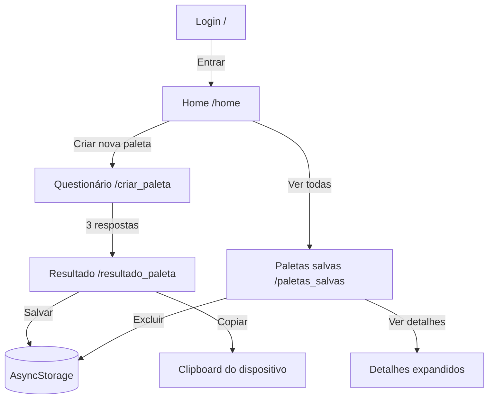

# Auditoria e arquitetura do Satura

## 1. Visão geral

Satura é um aplicativo universal construído com Expo SDK 57, React Native 0.86 e Expo Router. O mesmo código atende Android, iOS e web.

O fluxo principal permite que a pessoa:

1. Acesse a tela de entrada.
2. Entre na home.
3. Responda a três perguntas sobre finalidade, sensação e tonalidade.
4. Gere uma paleta determinística.
5. Copie códigos hexadecimais.
6. Salve a paleta localmente no dispositivo.
7. Consulte, expanda e exclua paletas salvas.

Não existe backend próprio, banco de dados remoto, autenticação real ou requisição HTTP de negócio no estado atual. A persistência é feita exclusivamente com `@react-native-async-storage/async-storage`.

## 2. Tecnologias e execução

- Expo SDK `~57.0.20`.
- React `19.2.3`.
- React Native `0.86.3`.
- React Native Web `0.21.0`.
- Expo Router com rotas baseadas em arquivos.
- TypeScript em modo estrito.
- React Compiler habilitado em `app.json`.
- Reanimated e Worklets para animações do template.
- Expo Clipboard para copiar cores.
- Expo Image para imagens.

Comandos definidos em `package.json`:

```bash
npm install
npx expo start
npm run web
npx tsc --noEmit
npx expo export --platform web
```

`npm run lint` existe, mas depende de uma configuração ESLint que não está presente no projeto atualmente.

## 3. Mapa de arquivos

```text
/
├── app.json                       Configuração Expo, ícones e plugins
├── package.json                   Dependências e scripts
├── package-lock.json              Lockfile do npm
├── tsconfig.json                  TypeScript, aliases e modo estrito
├── README.md                      README padrão do Expo
├── AGENTS.md                      Regra local: consultar documentação Expo v57
├── CLAUDE.md                      Referência para AGENTS.md
├── LICENSE                        Licença do projeto
├── scripts/
│   └── reset-project.js           Script destrutivo de reset do template
├── assets/
│   ├── images/                    Ícones, logos, splash e imagens do template
│   └── expo.icon/                 Recursos do ícone iOS
├── src/
│   ├── app/                       Rotas e telas do Expo Router
│   ├── components/                Componentes compartilhados/template
│   ├── constants/                 Tema e contrato de paletas
│   ├── hooks/                     Hooks de tema e esquema de cores
│   ├── utils/                     Funções utilitárias puras
│   └── global.css                 Variáveis CSS e estilo web do logo
└── docs/
    └── ARQUITETURA.md             Este documento
```

## 4. Configuração da aplicação

### `app.json`

Define o identificador visual e as capacidades do app:

```json
{
  "expo": {
    "name": "Satura",
    "slug": "Satura",
    "scheme": "satura",
    "web": { "output": "static" },
    "experiments": {
      "typedRoutes": true,
      "reactCompiler": true
    }
  }
}
```

- `scheme` permite deep links como `satura://`.
- `web.output = "static"` faz o Expo Router gerar páginas web estáticas.
- `typedRoutes` habilita validação de rotas pelo Expo Router.
- O plugin `expo-router` registra a infraestrutura de navegação.
- O plugin `expo-splash-screen` configura a tela nativa de abertura.

### `tsconfig.json`

Estende a configuração oficial do Expo, ativa `strict` e define aliases:

```json
"paths": {
  "@/*": ["./src/*"],
  "@/assets/*": ["./assets/*"]
}
```

Assim, `@/constants/palettes` aponta para `src/constants/palettes.ts`, evitando caminhos relativos frágeis.

### `src/app/_layout.tsx`

É o layout raiz do Router. Cada `Stack.Screen` declara uma rota e esconde o cabeçalho nativo:

```tsx
<Stack.Screen name="resultado_paleta" options={{ headerShown: false }} />
```

Rotas declaradas:

- `/` -> `src/app/index.tsx`.
- `/home` -> `src/app/home.tsx`.
- `/criar_paleta` -> `src/app/criar_paleta.tsx`.
- `/resultado_paleta` -> `src/app/resultado_paleta.tsx`.
- `/paletas_salvas` -> `src/app/paletas_salvas.tsx`.

Não há grupos de tabs ativos nem rotas protegidas.

## 5. Fluxo funcional completo



### Entrada para a home

Em `index.tsx`, o botão chama o Router:

```tsx
<TouchableOpacity style={styles.button} onPress={() => router.push("/home")}>
  <Text style={styles.buttonText}>Entrar</Text>
</TouchableOpacity>
```

1. `router.push("/home")` cria uma nova entrada na pilha.
2. A tela `home.tsx` é renderizada.
3. Não há validação de email ou senha e nenhum pedido de autenticação.
4. Os `TextInput` são atualmente visuais; seus valores não são armazenados.

## 6. Telas e regras de negócio

### `src/app/index.tsx`

Responsabilidade: tela inicial/login visual.

Componentes e comportamento:

- `LoginScreen`: obtém `router` com `useRouter` e renderiza a tela.
- Decorações: círculos superiores e linhas inferiores.
- Campos de email e senha: apenas apresentação; não possuem `value`, `onChangeText` ou estado.
- Botão `Entrar`: navega para `/home`.
- Texto `Criar conta`: não possui ação associada.

Exemplo do fluxo de navegação:

```tsx
const router = useRouter();

onPress={() => router.push("/home")}
```

`router` é a dependência de navegação; a tela não chama API nem acessa armazenamento.

### `src/app/home.tsx`

Responsabilidade: dashboard, criação de paleta e resumo das paletas salvas.

Tipos locais:

```tsx
type SavedPalette = {
  id: string;
  name: string;
  colors: { name: string; hex: string }[];
  savedAt: string;
};
```

Este tipo é uma visão reduzida do tipo completo usado no armazenamento. Os campos adicionais (`purpose`, `mood` e `tone`) são ignorados pela home.

#### Carregamento ao voltar para a tela

```tsx
useFocusEffect(
  useCallback(() => {
    void loadSavedPalettes().then(setPalettes);
  }, []),
);
```

- `useFocusEffect` é executado quando a rota recebe foco.
- Isso é importante porque uma paleta salva em `resultado_paleta` aparece quando a pessoa retorna à home.
- `loadSavedPalettes()` lê o AsyncStorage.
- `then(setPalettes)` atualiza a lista.
- `void` deixa explícito que a Promise é disparada sem bloquear o render.

#### Exclusão

```tsx
onPress: async () => {
  const remaining = await removeSavedPalette(palette.id);
  setPalettes(remaining);
};
```

A exclusão usa o mesmo id persistido, grava a lista restante e atualiza a tela imediatamente após a gravação.

#### Renderização condicional

```tsx
{
  palettes.length > 0 && <View>{/* cabeçalho e cards */}</View>;
}
```

Sem paletas, a home mostra apenas o destaque para criar uma nova. Com paletas, mostra cards resumidos e o link para `/paletas_salvas`.

### `src/app/criar_paleta.tsx`

Responsabilidade: questionário de três etapas.

Dados fixos:

- `purposes`: finalidade da paleta.
- `moods`: sensação desejada.
- `tones`: tonalidade clara ou escura.

Cada opção segue o contrato:

```tsx
type PaletteOption = {
  title: string;
  description: string;
  icon: string;
};
```

#### Estado do fluxo

```tsx
const [step, setStep] = useState(1);
const [selectedPurpose, setSelectedPurpose] = useState<string | null>(null);
const [selectedMood, setSelectedMood] = useState<string | null>(null);
const [selectedTone, setSelectedTone] = useState<string | null>(null);
```

- `step` varia de `1` a `3`.
- Cada seleção é guardada separadamente.
- `null` representa pergunta ainda não respondida.

#### Seleção dinâmica

```tsx
const options = step === 1 ? purposes : step === 2 ? moods : tones;

const selectedOption =
  step === 1 ? selectedPurpose : step === 2 ? selectedMood : selectedTone;
```

A tela escolhe o conjunto de opções e o valor selecionado de acordo com a etapa.

#### Avanço e geração

```tsx
function continueFlow() {
  if (!selectedOption) return;

  if (step === 3) {
    router.push({
      pathname: "/resultado_paleta",
      params: {
        purpose: selectedPurpose ?? "Outro",
        mood: selectedMood ?? "Calma e natural",
        tone: selectedTone ?? "Tons claros",
      },
    });
    return;
  }

  setStep((currentStep) => currentStep + 1);
}
```

Fluxo linha a linha:

1. Sem opção selecionada, a função retorna e o botão fica desabilitado.
2. Na terceira etapa, cria uma navegação para `/resultado_paleta`.
3. Os três valores são serializados como parâmetros da rota.
4. Os operadores `??` protegem contra estado nulo.
5. Nas etapas 1 e 2, apenas incrementa `step`.

`handleBack` retorna para `/home` na primeira etapa e reduz `step` nas etapas seguintes.

### `src/app/resultado_paleta.tsx`

Responsabilidade: calcular, exibir, copiar e salvar a paleta.

#### Parâmetros da rota

```tsx
const params = useLocalSearchParams<{
  purpose?: string | string[];
  mood?: string | string[];
  tone?: string | string[];
}>();

const purpose = getParam(params.purpose, "Outro");
const mood = getParam(params.mood, "Calma e natural");
const tone = getParam(params.tone, "Tons claros");
```

O Router pode entregar uma string ou uma lista de strings. `getParam` normaliza esse valor e fornece fallback quando o parâmetro está ausente.

#### Geração determinística

```tsx
const base =
  paletteSets[`${mood}|${tone}`] ?? paletteSets["Calma e natural|Tons claros"];
const offset = purpose.length % base.length;

return base.map((hex, index) => ({
  name: colorNames[(index + offset) % colorNames.length],
  hex,
}));
```

- `paletteSets` seleciona uma das seis combinações de humor e tonalidade.
- Se a combinação não existir, usa a paleta clara e natural.
- O tamanho do texto de finalidade gera um deslocamento circular nos nomes dos papéis das cores.
- Os hexadecimais não são alterados pelo algoritmo.
- O resultado sempre tem cinco cores para as combinações configuradas.

#### Cópia de cor

```tsx
async function copyColor(hex: string) {
  await Clipboard.setStringAsync(hex);
  setCopiedHex(hex);
}
```

O código hexadecimal vai para a área de transferência do sistema. Depois, `copiedHex` altera o texto de `Copiar` para `Copiado` na linha correspondente.

#### Salvamento

```tsx
const savedPalette: SavedPalette = {
  id: `${Date.now()}`,
  name,
  purpose,
  mood,
  tone,
  colors: palette,
  savedAt: new Date().toISOString(),
};

const savedPalettes = await loadSavedPalettes();
await saveSavedPalettes([savedPalette, ...savedPalettes]);
```

- O nome é aparado com `trim()`.
- Nome vazio interrompe a operação.
- `Date.now()` gera um id local.
- `toISOString()` registra a data em formato transportável.
- A nova paleta é colocada no início da lista.
- Depois da gravação, o modal fecha, `saved` fica `true` e um `Alert` confirma a operação.

A tela também oferece retorno para editar (`router.back()`) e retorno à home (`router.replace("/home")`).

### `src/app/paletas_salvas.tsx`

Responsabilidade: coleção persistida completa.

No carregamento:

```tsx
useEffect(() => {
  void loadSavedPalettes().then(setPalettes);
}, []);
```

Ao montar a tela, carrega uma vez a lista persistida. Diferentemente da home, essa tela não usa `useFocusEffect`; se a mesma instância permanecer montada e o armazenamento mudar em outra rota, ela não se atualiza automaticamente.

#### Expansão de detalhes

```tsx
onPress={() =>
  setExpandedId(expandedId === palette.id ? null : palette.id)
}
```

Apenas uma paleta pode ser considerada expandida por vez. Clicar na paleta já aberta fecha seus detalhes.

#### Exclusão e cópia

- `confirmDelete` exibe `Alert.alert` com cancelar/excluir.
- A opção destrutiva chama `deletePalette`.
- `deletePalette` usa `removeSavedPalette` e atualiza o estado.
- `copyColor` usa `Clipboard.setStringAsync` e exibe confirmação.
- `hexToRgb` apresenta o RGB ao lado do hexadecimal.

## 7. Módulos compartilhados

### `src/constants/palettes.ts`

É a fronteira de persistência local e o contrato central das paletas.

```tsx
export const SAVED_PALETTES_STORAGE_KEY = "satura:saved-palettes";
```

A mesma chave deve ser preservada para não perder dados já gravados.

```tsx
export async function loadSavedPalettes(): Promise<SavedPalette[]> {
  const storedPalettes = await AsyncStorage.getItem(SAVED_PALETTES_STORAGE_KEY);

  if (!storedPalettes) return [];

  try {
    const palettes: unknown = JSON.parse(storedPalettes);
    return Array.isArray(palettes) ? (palettes as SavedPalette[]) : [];
  } catch {
    return [];
  }
}
```

- Lê uma string JSON.
- Ausência de valor vira lista vazia.
- JSON inválido também vira lista vazia.
- O cast garante o tipo para o restante do TypeScript, mas não valida profundamente cada campo.

`saveSavedPalettes` serializa a lista com `JSON.stringify` e grava com `setItem`.

`removeSavedPalette` recarrega a lista, filtra pelo id, grava e retorna a lista restante.

### `src/utils/colors.ts`

Função pura para apresentação:

```tsx
export function hexToRgb(hex: string): string {
  const value = hex.replace("#", "");
  const red = Number.parseInt(value.slice(0, 2), 16);
  const green = Number.parseInt(value.slice(2, 4), 16);
  const blue = Number.parseInt(value.slice(4, 6), 16);

  return `${red}, ${green}, ${blue}`;
}
```

Entrada esperada: `#RRGGBB` ou `RRGGBB`.

Exemplo:

```ts
hexToRgb("#16645F"); // "22, 100, 95"
```

A função não valida comprimento nem caracteres inválidos. Valores malformados podem resultar em `NaN`.

## 8. Tema, fontes e CSS

### `src/constants/theme.ts`

- `Colors`: paletas claro/escuro usadas pelos componentes temáticos do template.
- `Fonts`: famílias por plataforma.
- `Spacing`: escala numérica usada nos componentes auxiliares.
- Importa `@/global.css` uma vez, garantindo a presença das variáveis CSS no web.

A família serifada está definida assim:

```tsx
web: {
  serif: "var(--font-serif)",
}
```

E no CSS web:

```css
--font-serif: ui-serif, Georgia, Cambria, "Times New Roman", serif;
```

As telas de negócio usam `Fonts.serif` para títulos, textos, botões e entradas. O componente de código usa `Fonts.mono`.

### `src/global.css`

É o único CSS do projeto. Contém:

- variáveis de fonte;
- variáveis do logo web;
- `.expoLogoBackground`, usada apenas por `animated-icon.web.tsx`.

Os estilos de layout das telas não são CSS: são objetos `StyleSheet` do React Native para manter compatibilidade nativa.

## 9. Componentes compartilhados e template

### `src/components/themed-text.tsx`

`ThemedText` aplica uma cor obtida por `useTheme` e um dos tipos (`default`, `title`, `small`, `subtitle`, links ou código). É um componente genérico do template Expo. As telas Satura atuais usam principalmente `Text` diretamente.

### `src/components/themed-view.tsx`

`ThemedView` calcula `backgroundColor` com base no tema e aceita um `style` adicional. `lightColor` e `darkColor` fazem parte da API declarada, mas não são usados na implementação atual.

### `src/components/ui/collapsible.tsx`

`Collapsible` mantém `isOpen` local, alterna com `setIsOpen`, gira o símbolo Chevron e mostra os filhos com `FadeIn`. Não há importação dessa tela pelas rotas de negócio atuais.

### `src/components/external-link.tsx`

`ExternalLink` usa `Link` do Expo Router. No web permite abrir em nova aba. No nativo cancela o comportamento padrão e chama `openBrowserAsync` para abrir um navegador interno.

### `src/components/web-badge.tsx`

Mostra a versão do pacote Expo e escolhe entre badge claro/escuro conforme `useColorScheme`. É componente de template e não aparece no fluxo Satura atual.

### `src/components/hint-row.tsx`

Renderiza uma linha com título e dica usando `ThemedText` e `ThemedView`. Também não é usado pelas rotas atuais.

### `src/components/animated-icon.tsx`

Versão nativa de um ícone animado:

- `AnimatedSplashOverlay` controla o splash nativo.
- `AnimatedIcon` anima logo, glow e fundo.
- `Keyframe`, `Easing`, `scheduleOnRN` e `expo-splash-screen` controlam a sequência.

### `src/components/animated-icon.web.tsx`

Versão web da animação. Usa `.expoLogoBackground` em um elemento `div` e `react-native-reanimated` para os keyframes. O `AnimatedSplashOverlay` web atualmente retorna `null`.

## 10. Hooks

### `src/hooks/use-color-scheme.ts`

Exporta diretamente `useColorScheme` do React Native para Android/iOS.

### `src/hooks/use-color-scheme.web.ts`

Evita divergência na renderização estática web:

```tsx
const [hasHydrated, setHasHydrated] = useState(false);

useEffect(() => {
  setHasHydrated(true);
}, []);

if (hasHydrated) {
  return colorScheme;
}

return "light";
```

Antes da hidratação, sempre retorna `light`, reduzindo diferenças entre HTML estático e cliente. Depois, usa o esquema real do navegador.

### `src/hooks/use-theme.ts`

Converte o esquema em uma entrada de `Colors`:

```tsx
const scheme = useColorScheme();
const theme = scheme === "unspecified" ? "light" : scheme;
return Colors[theme];
```

É consumido pelos componentes temáticos do template, não diretamente pelas telas Satura.

## 11. Assets

`assets/images` contém recursos visuais do template e do Expo:

- `icon.png`, `favicon.png`: ícone do app e favicon.
- `splash-icon.png`: imagem da tela de abertura.
- `android-icon-*`: variações adaptativas Android.
- `expo-logo.png` e `logo-glow.png`: animação do componente de logo.
- `expo-badge*.png`: badges do componente web.
- `tabIcons/*`: ícones herdados do template; não há tabs ativas no layout atual.
- `react-logo*`, `tutorial-web.png`: recursos de demonstração/template.

`assets/expo.icon` contém metadados e recursos do ícone iOS.

## 12. Dependências e integrações

### Persistência

```text
resultado_paleta.tsx
        │ saveSavedPalettes/loadSavedPalettes
        ▼
constants/palettes.ts
        │ AsyncStorage.getItem/setItem
        ▼
armazenamento local do dispositivo/navegador
```

No web, o AsyncStorage é implementado pelo adaptador web correspondente. Não há sincronização entre dispositivos.

### Área de transferência

`expo-clipboard` integra com a área de transferência do sistema. A operação ocorre apenas quando a pessoa toca em `Copiar`.

### Navegação

`expo-router` conecta os arquivos em `src/app` e transporta os parâmetros do questionário para o resultado. Não existe API HTTP para as rotas; são rotas de interface.

### Fontes e imagens

`expo-image` renderiza assets locais. Não há arquivos `.ttf`, `.otf`, `.woff` ou `.woff2` no repositório, portanto a fonte serifada usa famílias disponíveis no sistema.

## 13. Pontos de atenção e riscos

1. **Login não é autenticação real.** Email e senha não têm estado, validação nem chamada de servidor. O botão apenas navega.
2. **"Minha conta" é armazenamento local.** O texto da interface sugere conta, mas os dados ficam no dispositivo atual e não são sincronizados.
3. **Validação de JSON é superficial.** `loadSavedPalettes` confirma apenas que o valor é um array; objetos inválidos podem chegar às telas.
4. **IDs dependem de `Date.now()`.** Duas gravações no mesmo milissegundo poderiam gerar colisão rara.
5. **Leitura e escrita não são transacionais.** Duas operações concorrentes podem sobrescrever uma à outra.
6. **Resultado depende de parâmetros de rota.** Parâmetros ausentes recebem fallback; parâmetros inválidos de texto podem gerar uma combinação fallback ou deslocamento inesperado.
7. **`hexToRgb` não valida entrada.** Hexadecimal incompleto produz `NaN`.
8. **Paletas salvas não recarregam ao recuperar foco.** A home usa `useFocusEffect`, mas `paletas_salvas` usa `useEffect` apenas na montagem.
9. **Componentes de template não utilizados.** `hint-row`, `external-link`, `web-badge`, `collapsible` e os ícones animados não fazem parte do fluxo atual, mas permanecem compiláveis no projeto.
10. **ESLint não está configurado.** O script existe, mas `expo lint` não consegue executar sem configuração.
11. **Acessibilidade é parcial.** Alguns botões têm `accessibilityLabel`; outros textos clicáveis, como `Criar conta`, não têm ação nem papel explícito.
12. **A fonte serifada é dependente do sistema.** A aparência exata pode variar entre plataformas porque não há uma fonte customizada incorporada.

## 14. Cenário prático completo

Supondo que a pessoa faça as escolhas:

```text
purpose = "Projeto de design"
mood = "Vibrante e criativa"
tone = "Tons claros"
```

1. `criar_paleta` guarda cada escolha no estado.
2. Na terceira etapa, navega para `/resultado_paleta` com esses três parâmetros.
3. `buildPalette` procura `"Vibrante e criativa|Tons claros"`.
4. Obtém os cinco hexadecimais configurados para essa combinação.
5. Calcula `"Projeto de design".length % 5` para deslocar os nomes `Principal`, `Complementar`, `Neutro`, `Apoio` e `Destaque`.
6. Renderiza a faixa de cores e a lista detalhada.
7. Ao tocar em salvar, abre o modal.
8. Após informar um nome, cria `SavedPalette`, lê as paletas antigas e grava `[nova, ...antigas]`.
9. Ao voltar para home, `useFocusEffect` lê novamente a chave e mostra o card recém-criado.
10. Em `paletas_salvas`, o usuário pode expandir detalhes, copiar um hex ou excluir a paleta.

## 15. Limites desta auditoria

- Não há servidor, endpoints ou banco remoto para auditar.
- Não há suíte de testes automatizados no `package.json`.
- A auditoria cobre o código fonte e a configuração presentes no workspace no momento da geração deste documento.
- O diretório `dist` gerado por export web é artefato de build e não faz parte da arquitetura fonte.
